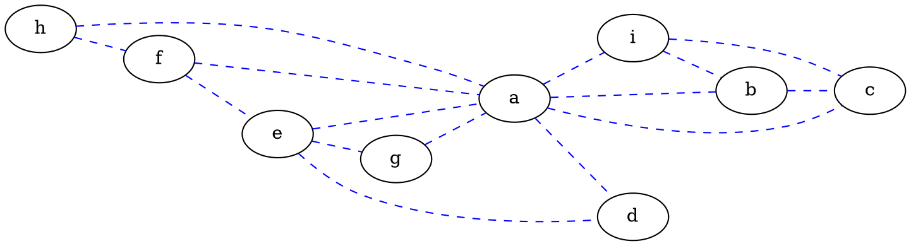
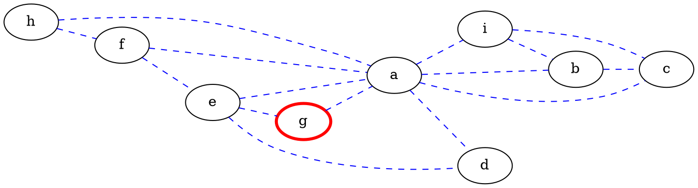
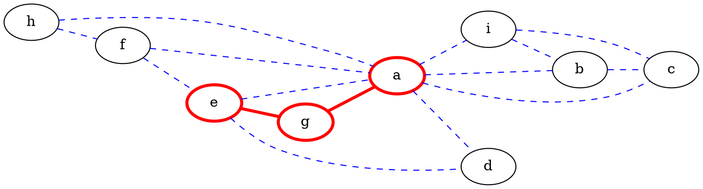
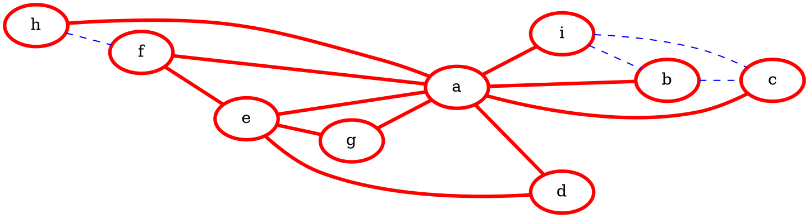
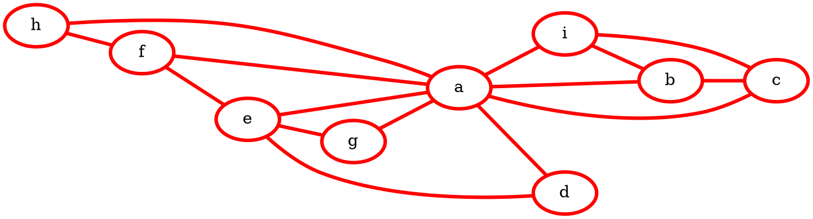
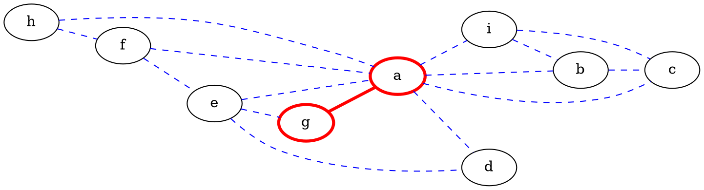
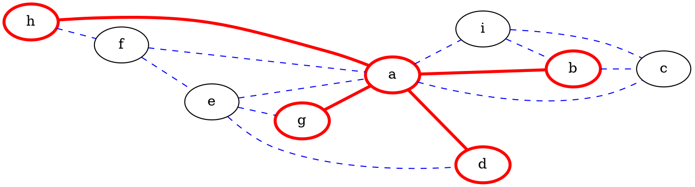
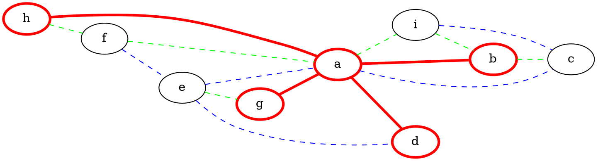
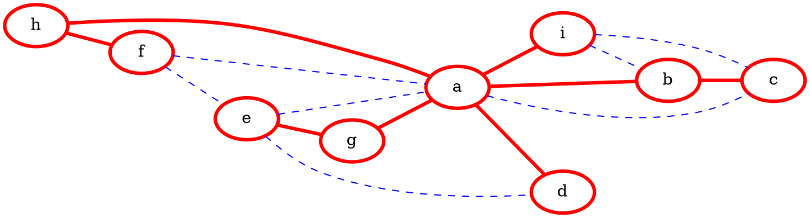

---
title: Waku v2 training session
tags: Waku, Waku v2, Whisper, Vac, Training, Talk
description: Introduction to Waku v2 with basic training.
slideOptions:
    spotlight:
        enabled: false
---

# Waku v2 training

Note:
> Link to recorded session: https://drive.google.com/file/d/19P3oDNXGBDClfcS6Sgp0t9LYr3UbIFGt/view

Hi everyone, and welcome to Waku v2 training!

The goal of this session is to provide some context for how Waku v2 came to be and then introduce some basic Waku v2 concepts: its suite of protocols, how it looks in practice, and the existing implementations.

---

# Program

1. A short history
2. Waku v2 protocols
3. The Waku network
4. Waku v2 implementations
5. The future
6. Q&A

Note:
We hope to fit quite a bit into this session, with enough time for Q&A at the end.
If, by the end, we did not cover everything you wanted to see covered, or failed to answer all your questions, feel free to contact the Vac team at any time.
We could also organize as many follow-up sessions as are necessary for everyone interested to get familiar with Waku v2.
As you can see we'll
- start in the past, to clarify the history of how Waku v2 came to be, and
- end in the future - the current and planned research areas for Waku v2.

In between we will:
- focus on some of the main Waku v2 protocols,
- look at how a Waku messaging network may look in practice, and
- the different implementations that already exist

---

# A short history

Note:
So, as promised let's look at how Waku v2 came into being

---

## The "holy trinity"

- Ethereum: compute/consensus
- Swarm: storage
- Whisper: messaging

Note:
In the original vision for the decentralized web, there were three pillars, a type of “holy trinity”.
You had Ethereum for compute/consensus, Swarm for storage, and Whisper for messaging.

Whisper, being a somewhat esoteric protocol and with some fundamental issues, didn’t see a lot of usage. However, the Status application had the goal of being both a window onto Ethereum and a secure messenger, thus adopting Whisper as p2p messaging protocol. As one of the few, if not the only, apps using Whisper in production, not to mention on a mobile phone, we quickly realized there were problems with the underlying protocols and infrastructure.

---

## Whisper

- Poor scalability
- Poor spam-resistance
- No incentivization

> See: [Fixing whisper with waku](https://vac.dev/fixing-whisper-with-waku)

Note:
Some of the fundamental issues with Whisper included:
- Scalability issues, especially related to bandwidth and high amplification factors
- Poor spam resistance due to incompatibility of proof-of-work with mobile devices
- No built-in way to provide incentivization for running nodes

---

## Vac team

- Vac: protocol research and development team
- Waku v1: incremental improvement on Whisper
- Waku v2: new protocol built on `libp2p`

Note:
Enter: the Vac team. Vac was born out of the desire to address some of these challenges in a systematic manner. Vac is an R&D unit doing protocol research focused on creating modular p2p messaging protocols for private, secure, censorship resistant communication

The Vac team's first effort was to understand and document the existing tweaks to get Whisper to run on a mobile phone, and being more rigorous about privacy guarantees. Previously there was implicit knowledge about Whisper's lack of scalability, but little understanding of what the trade-offs were in practice.
Eventually this led to a fork of the Whisper protocol, with some tweaks aimed at resource restricted devices. These were encapsulated in Waku v1, a suite of protocols built on Whisper that addressed some of the immediate shortcomings.
Waku v1 introduced, for example:
- a more bandwidth-efficient way for peers to express interest in receiving only certain messages
- a "light mode" where a resource restricted peer's contribution to the p2p network could be limited
- a mail server

Waku v1 remained very closely related to Whisper and merely adds incremental improvements.

However, Waku v1 still had some fundamental scalability issues that required a more radical break with the Whisper protocol if we were to create a truly scalable, resource-efficient peer-to-peer messaging protocol.
Waku v2 is a completely re-thought protocol, or rather _suite of protocols_, built on top of `libp2p`. It does not build on Waku v1 in any meaningful way, though we have specified some rules for interoperability.

---

# Waku v2

Note:
Waku v2 will be the focus of today's session.

---

## What is Waku v2?

A privacy-preserving, peer-to-peer, generalized messaging protocol aimed at resource-restricted devices.

Note:
What is Waku v2? It is a 
- privacy-preserving
- peer-to-peer
- generalized messaging protocol, aimed at
- resource-restricted devices.

Those are a bunch of terms bundled in a single definition, so let's look at each concept as a separate goal of Waku v2.

---

## Goals

- Privacy preservation
- Peer-to-peer
- Generalized messaging
- Resource-restricted environments

Note:
- Firstly Waku v2 provides privacy preserving capabilities, such as sender anonymity, metadata protection, unlinkability to personally identifiable information, etc.
- Secondly, it is peer-to-peer, with the accompanying benefits provided by decentralization: no single point of failure, sharing infrastructure, etc.
- It also aims to be useful for generalized messaging. This messaging can be human-to-human or machine-to-machine, or a mix.
- Many applications run in resource-restricted environments, e.g. running from a browser, limited bandwidth or battery-life, intermittent connectivity, etc.

Importantly, we try to provide these properties in a _modular_ fashion, so applications can choose their desired properties with accompanying trade-offs. We call this concept _adaptive nodes_. More on this later.

It may be worth pausing for a minute to remind ourselves why this is important:
- Sender anonimity, or at least pseudonimity, implies that there is no way for us to link a message to any identifying information of the sender (other than their chosen pseudonym). Where any such linkability remains, it can be exploited. For example, you may have seen the [recent report](https://techcrunch.com/2021/09/06/protonmail-logged-ip-address-of-french-activist-after-order-by-swiss-authorities/) where ProtonMail leaked the IP address of one of its users to authorities.
- Decentralization is important as it provides resilience against censorship. Any centralized topology can be shut down by simply disabling the central servers. For Status we want to move to a world where we don't rely on our own infrastructure to maintain network integrity. In April 2019, Status shut down all its own infrastructure during a [chaos unicorn day](https://our.status.im/chaos-unicorn-day-what-we-learned-by-breaking-status/) to see how it might break Status functionality. The network managed to recover within an hour or two.

---

## Waku v2 in practice

- Set of protocols
- Network of nodes
- Set of implementations

Note:
In other words, we can refer to Waku v2 in practice as several things:
Either
- a set of protocol specifications to achieve the Goals from the previous slide,
- a network of nodes running Waku v2 protocols, or
- the set of implementations of those protocols

For the rest of this session we'll look at Waku v2 from each of these perspectives: the protocols, the network and the different implementations.
We'll start with the protocols, but first it's important to make clear the relationship between Waku v2 and `libp2p`.

---

## Waku v2 and `libp2p`


Waku v2 builds on `libp2p`,
a modular peer-to-peer network stack.

Note:
Often when people encounter Waku v2 for the first time, the relationship with `libp2p` is not immediately clear.
Waku v2 protocols build on the p2p network stack provided by `libp2p` and adds some functionality to it.
Waku v1 and Whisper were built on `devp2p`.
`libp2p` is basically "devp2p done right".
For example, there are some [fundamental issues with encryption](https://github.com/ethereum/devp2p/blob/master/rlpx.md#known-issues-in-the-current-version) in `devp2p` and, although things like ETH1 is currently running on it, no one else is really building on `devp2p`.
`libp2p` was developed for IPFS but now many projects use it, Ethereum 2 included. It is therefore quite mature,  with many implementations and a large part of the crypto/p2p community behind it. While it's not perfect, it's very modular and easy to extend with new transports, user-defined protocols, etc.

---

## `libp2p` functionality

- addressing
- p2p dialing
- multiple transports
- connection encryption
- protocol identification & negotiation

Note:
What do we mean when we say Waku v2 "builds" on `libp2p`?
`libp2p` provides us with the toolbox to build peer-to-peer protocols.
We rely on it for things like:
- peer addressing and
- peer dialing (or the setting up of a p2p connection), over
- multiple transports (e.g. TCP, websockets)
- securing connections on a transport layer (e.g. noise protocol), and
- a system for identifying and negotiating protocols between peers.

> Note: May have to stop here for questions about relationship with libp2p

Importantly, our main routing protocol, `11/WAKU2-RELAY` is based on the `libp2p`-defined protocol `GossipSub`. This is the first Waku v2 protocol we'll discuss in some detail.

---

## `11/WAKU2-RELAY`: Overview

- thin layer on `libp2p` `gossipsub`
- message dissemination
- pub/sub: peer grouping around topics
- gossip-based routing

Note:
Waku-`relay` is a thin layer on top of `libp2p` `gossipsub` and describes how messages disseminate through the p2p network. `gossipsub` itself uses a _publish-subscribe_ approach to congregate peers around common interest, and then uses a form of _gossiping_ to ensure messages spread between those peers.

I'll explain both these concepts in some detail next. For now, it suffices to know that the `relay` protocol does not really add to `gossipsub` i.t.o. functionality. Rather it describes _how_ the underlying `gossipsub` is to be interpreted and implemented within Waku's context. For example, `relay` specifies that certain `gossipsub` fields that could leak PII should never be used.

> Note: It's possible to expand here quite a bit on the `StrictNoSign` signature policy, though those interested should get a clear enough idea from the `11/WAKU2-RELAY` spec.

---

## `11/WAKU2-RELAY`: pub/sub

- `pub/sub` topic for:
    - peer congregation via subscription
    - message routing via publishing
- `pub/sub` topic ~= separate p2p network

Note:

As stated before, gossipsub is _pub/sub_ protocol.
That means that peers congregate around certain topics, which we'll call `pubsub` topics.
Peers _publish_ messages to these topics and only receives and relays messages on topics that they themselves are _subscribed_ to.
All the peers subscribed to a specific topic connect to each other to form a _mesh_ of interconnected peers, with new messages being routed by peers to other peers in the mesh until everyone has received a copy.
Since message routing always happens within a pubsub topic, peers subscribed to different pubsub topics can be said to be in different p2p (sub)networks. A peer "joins" the network, by subscribing to the pubsub topic defining that network.

Let's look at one way in which these messages may be routed between peers subscribed to the same pubsub topic.

----

### Routing example: flooding (1)



Note:
For example, consider this highly simplified diagram of a p2p network, with all these peers subscribed to the same pub/sub topic. As is the case with p2p networks you have some nodes, such as `a` being densely-connected to its surrounding peers, while, say `g` and `h`, have only a few connections to peers.

----

### Routing example: flooding (2)



`g` wants to publish a message

Note:
Now, say `g` wants to publish a new message to the pubsub topic. One somewhat naïve way to route this message to all peers in the network is to perform _flood_ routing. It works as follows.

----

### Routing example: flooding (3)



`g` floods message to connected peers

Note:
`g` publishes the message to all its connected peers for this topic. These peers, `a` and `e`, follows the same algorithm and similarly...

----

### Routing example: flooding (4)



`g`'s connected peers flood message

Note:
...floods the message to all their connected peers. Now you can see that the message has already been routed to everyone in the network, but in an incredibly inefficient manner. `f` and `d`, for example, have received this message now from two different sources. What's more...

----

### Routing example: flooding (5)



the pattern continues...

Note:
...this pattern will continue. This redundancy/duplication wastes bandwidth and resources. What's more, the larger the network becomes, the more redundant messages will be routed as each *connection* will receive a copy of the message, rather than each peer. Flood routed networks therefore scale (really) badly.
This is essentially the type of routing used in Whisper/Waku v1 and explains why Waku v2 introduced a new type of routing based on `gossipsub`.

---

## `11/WAKU2-RELAY`: gossipsub

- Forward full message to _subset_ of peers
- Gossip about seen messages to others 
- Limits amplification factor
- Types of peering:
    - full-message peerings: `mesh` peers
    - metadata-only peerings: `gossip` peers

Note:
A full explanation of how gossipsub message routing works falls beyond the scope of this session, but the basic principle is easy enough:

When a peer receives a message on a pubsub topic, it forwards the full contents of that message _only to a subset_ of its connected peers. It then periodically shares _gossip_ about which messages are available to other peers. These gossip messages contain only metadata. The advantage is that redundant copies of the full message (~ the _amplification factor_) is limited, thus reducing the bandwidth required to participate in the network.

The result is that each peer essentially has two types of connections to its peers within the same pubsub topic:
- full message peerings (termed the `mesh`)
- metadata-only peerings (termed `gossip` peers)

----

### Routing example: gossipsub (1)


`g` wants to publish a message

Note:
Let's see how it might work by returning to the previous example. In the same network as before `g` wants to publish a message to the illustrated pub/sub topic. But now, instead of publishing the message to all its connected peers...

----

### Routing example: gossipsub (2)



`g` sends full message to a _subset_ of peers

Note:
...it only publishes it to a subset of peers. In this case `a`.

----

### Routing example: gossipsub (3)



`a` relays message, also to a _subset_ of peers

Note:
`a` follows the same routing protocol and forwards the message only to a subset.

----

### Routing example: gossipsub (4)



peers periodically _gossips_ (metadata-only)

Note:
All peers will periodically _gossip_ about their seen messages to their metadata-only peers, indicated here by the green connections.

----

### Routing example: gossipsub (5)



peers periodically requests missed messages

Note:
These peers can then periodically request missed messages.
This then shows a highly idealized routing scenario where a message is routed to all peers with little or no duplication.
Of course, in practice, some redundancy will be inevitable if the network is to remain stable.
`libp2p` suggests that peers should aim for ~6 mesh peers for full message exchange (min = `4`, max = `12`) for the network to remain both stable and robust.

Compared to flooding, this routing method really improves scalability. 
There have been thorough scaling studies of `gossipsub` and it is in use for IPFS and ETH2 - both huge p2p networks.

> Note: Pause for questions

---

## `14/WAKU2-MESSAGE`

```protobuf
message WakuMessage {
  bytes payload = 1;
  string contentTopic = 2;
  uint32 version = 3;
  double timestamp = 4;
}
```

Note:
What payload is actually being passed around in Waku? In other words, what do the messages that we route in the network look like? This is defined in RFC 14. All Waku protocols operate on `WakuMessage`s.

For those interested, I've included the protobuf definition of a `WakuMessage`. The fields are straight-forward:
- each message contains a `payload`, defined by the application
- the `contentTopic` is used for content-based filtering and is also application-specific. This should not be confused with the `pubsub` topic, that is used for routing. Content topics do not affect routing at all, but could rather be used to identify/filter for a specific application _within_ the pubsub network. We'll talk more about how content topics are used for content filtering when we look at request/response protocols.
- the message `version` won't feature much during this session, but is used to signify if the payload is encrypted and, if so, what encryption was used. Applications providing their own encryption can omit this field, or use version `0`.
- `timestamp` is self-evident, and used to time-order messages where that is required.

---

## `23/WAKU2-TOPICS`: best practices

- PubSub topics:
    - use single `pubsub` topic
    - use default Waku `pubsub` topic:
        - `/waku/2/default-waku/proto`
    - run own node, not own network

Note:
Based on how `gossipsub`, and by extension waku-`relay`, routes messages on a pubsub topic, there are a couple of best practices that we suggest for topic usage:
- since each pubsub topic constitutes a "separate" p2p network, anonymity is much better maintained if all peers congregate around a _single_ pubsub topic. Waku, for example, will use `/waku/2/default-waku/proto` by default.
- we envision this default network to be a public good. If you run your own node subscribed to the default topic, you will therefore be contributing to make the default network more robust and share in the existing infrastructure. It benefits everyone who participates in the network.
- if you define a separate pubsub topic, you will need to establish your own network. This may be desirable/necessary for some applications (e.g. WalletConnect). It could also be used as a technique to "shard" (split up) the network into separate pubsub topics on separate pools of resources, if it becomes necessary (e.g. heavy community users)

---

## `23/WAKU2-TOPICS`: best practices

- Content topics:
    - content topic per application
    - example:
        - `/toychat/2/huilong/proto`

> See: [`23/WAKU2-TOPICS`](23/WAKU2-TOPICS)

Note:
Content topics do _not_ impact routing, so could theoretically take an arbitrary value. They _are_ used for content-based filtering, so is suitable to identify an application, or at least a discrete functionality, _within_ the network. For this reason, we have a suggested format where your application and current version is uniquely identified. For example, our dev toy-chat application, used for dogfooding Waku v2, uses the content topic: `/toychat/2/huilong/proto`

Feel free to take a look at RFC 23 for more topic recommendations.

---

## `13/WAKU2-STORE`: message history

- fetch historical messages
- request/response
- client sends `HistoryQuery`
- service responds with `HistoryResponse`
- paginated, content-filtered

Note:
The next protocol we'll look at is Waku-`store`.
`Store` describes how peers that were offline may fetch historical messages, that they may have missed, from other peers.
This is the first of Waku's request/response protocols that we'll discuss, because it functions as a _service_ that some peers may choose to provide to other peers on request. In this instance it's a service provided by waku-`relay` nodes to store a certain amount of messages.
"Client" nodes can then query the store to retrieve history. History may be retrieved in fixed-length "bundles", or _pages_. Clients can also provide filter criteria to query history only for specific content topics.

----

### `13/WAKU2-STORE`: call flow

```sequence
Client -> Service: HistoryQuery:\npageLength, contentFilters
Note left of Service: Retrieve first\npage of history
Service -> Client: HistoryResponse:\nmessages, nextPage
Note right of Client: Determines if\nsubsequent pages\nnecessary
Client -> Service: HistoryQuery:\nnextPage, pageLength, contentFilters
Note left of Service: Retrieve next\npage of history
Service -> Client: HistoryResponse
Note over Service,Client: Query/Response continues\nuntil full history retrieved
```

Note:
In its simplest form then a client node may send a `HistoryQuery` to a `store` service node, indicating how many historical records to retrieve at a time (the `pageLength`) and for which content topics (set in the `contentFilters`). The service responds with the first page of history and a cursor pointing to the `nextPage`. The client can continue asking for pages of history in a similar fashion until it's satisfied that it has retrieved all the history it is interested in.

----

### `21/WAKU2-FAULT-TOLERANT-STORE`

- state synchronisation between store nodes
- time-based query criteria
- suitable for intermittent connections
- reduce reliance on cluster

> Read more: [`21/WAKU2-FAULT-TOLERANT-STORE`](https://rfc.vac.dev/spec/21/)

Note:
Although the `store` protocol provides basic functionality to maintain message history, it has some limitations that are addressed by our fault-tolerant store protocol.
- For example, `store` has high availability and uptime requirements of store nodes. Store nodes themselves could be offline and miss messages.
- The fault-tolerant store specifies a way for store nodes to synchronise their state and resume history after being offline.
- It does so by providing a way for clients to request history for a specific time period that they might have missed.
- The fault-tolerant store protocol is therefore suitable for intermittently connected nodes.
- This makes it easier for user-run Waku nodes to provide `store` functionality, reducing our reliance on the Status-run cluster nodes.

We seek to address this problem of state-synchronisation in the fault-tolerant store protocol, RFC 21. Those interested are welcome to dive a bit deeper.

---

## Minimal implementation

- [`10/WAKU2`](https://rfc.vac.dev/spec/10/)
- [`11/RELAY`](https://rfc.vac.dev/spec/11/)
- [`13/STORE`](https://rfc.vac.dev/spec/13/)
- [`14/MESSAGE`](https://rfc.vac.dev/spec/14/)

Note:
Before we continue, let's take a look at what we've covered so far i.t.o. Waku v2 protocols.
We've described how waku-`relay` performs routing, based on `libp2p` `gossipsub`. We've seen how message history can be stored and retrieved, and we've defined what these `WakuMessage`s look like. In fact, combining these RFCs - together with RFC 10, that describes how everything fits together - already provides you with a minimal subset for a Waku v2 node.

The rest of the protocols we'll cover relates to even more lightweight nodes.

---

## `12/WAKU2-FILTER`

- content-based filtering
- request/response
- client sends `FilterRequest`
- service responds with `MessagePush`

Note:
A `relay` node participates in all its subscribed pubsub topics as a _router_, in other words it receives all messages on that topic and forwards it again according to the `gossipsub` protocol. This may require an unacceptably high bandwidth requirement for some nodes, especially if a large number of applications make use of a single pubsub topic, as is suggested for anonymity.
`Filter` protocol allows resource restricted nodes to _subscribe_ to `relay` nodes to receive only the messages they desire.

----

### `12/WAKU2-FILTER`: Call flow

```sequence
Client -> Service: FilterRequest:\nid=`1`, contentTopic=`a`
Note right of Service: Receive some\nmessage `m1` with\ncontentTopic=`a`
Service -> Client: FilterResponse:\nid=`1`, message=`m1`
Note right of Service: Receive another\nmessage `m2` with\ncontentTopic=`a`
Service -> Client: FilterResponse:\nid=`1`, message=`m2`
```

Note:
This is also a request response protocol, similar to `store`.
A resource restricted node sends a `FilterRequest` to a service node that fully participates in the waku-`relay` network. The `FilterRequest` contains a `ContentFilter` with the list of content topics that the client node is interested in.
In this example the client subscribes to receive only messages that have their contentTopic set to `a`.
The service node monitors all `relay` traffic and pushes any messages with a matching content topic to the client node in a `MessagePush` response.
It will continue doing so until the client disconnects or unsubscribes.

---

## `19/WAKU2-LIGHTPUSH`

- light message publishing
- request/response
- client sends `PushRequest`
- service responds with `PushResponse`

Note:
Additionally, nodes with short connection windows and limited bandwidth may wish to _publish_ messages onto the Waku network without performing `relay` routing themselves.
For example, on a mobile device you might go offline before a message you want to send has been disseminated.
Waku-`lightpush` is a request/response protocol for this.

----

### `19/WAKU2-LIGHTPUSH`: Call flow

```sequence
Client -> Service: PushRequest:\nid=`1`, message=`m1`, pubsubTopic = `t1`
Note right of Service: Publish message `m1`\non pubsubTopic `t1`
Service -> Client: PushResponse:\nid=`1`, success=`true`
Client -> Service: PushRequest:\nid=`2`, message=`m2`, pubsubTopic = `t2`
Note right of Service: Fail to publish\nmessage `m2`\non pubsubTopic `t2`.\nNo suitable peers.
Service -> Client: PushResponse:\nid=`2`, success=`false`
```

Note:
The resource restricted client sends a `PushRequest` to a service node in the Waku network, containing the `WakuMessage` it wants published and the target pubsub topic.
If the service node is able to publish the message to the desired pubsub topic, it responds with a successful `PushResponse`. Otherwise it responds with an error.
This can then act as an "ACK" from a node in the service network that your message has been sent.

---

## `filter` and `lightpush`

- low resource requirements
- receive and publish messages
- some privacy trade-offs

Note:
You may notice that a node can fully participate in the network in a resource efficient way by running only `filter` and `lightpush` protocols.
`Filter` protocol allows it to receive only the messages it is interested in, while it only publishes its _own_ messages using `lightpush`.
This shows some similarity to what was called a "light node" in Waku v1. Note that Waku v2's modular nature allows us to be much more precise in choosing a node's level of contribution to the network based on its resource availability. We therefore have more of a continuum in terms of resource usage than a binary "light" or "full" node. (We call this concept "adaptive nodes", which we'll discuss in the next section.)
Also note that the resource efficiency in both `filter` and `lightpush` comes at the cost of some privacy. For `filter` a client node has to reveal its content topic interest to the service node.`Lightpush` may break sender anonymity as the service node is able to identify the client as the originator of the light-pushed message. We are working on ways to anonymize both these protocols.

---

## Other protocols

- [`15/WAKU-BRIDGE`](https://rfc.vac.dev/spec/15/)
- [`17/WAKU-RLN`](https://rfc.vac.dev/spec/17/)
- [`21/WAKU2-FAULT-TOLERANT-STORE`](https://rfc.vac.dev/spec/21/)
- and many more on [rfc.vac.dev](https://rfc.vac.dev)!

Note:
I've introduced some of the main protocols required to understand a Waku v2 network.
There are many other specifications in various stages of maturity on our rfc site, which I encourage you to go read and ask questions about.
For example,
RFC 15 specifies a bridge between Waku v1 and Waku v2,
RFC 17 proposes a spam-protection mechanism using Rate Limiting Nullifiers, while
the fault-tolerant `store` protocol is specified in RFC 21,
etc.

---

# The Waku Network

---

## Typical network topology


Note:
Let's take a look at what a network of Waku nodes might look like.
It may be too intricate for a clear understanding on first glance, but we'll look into each feature in detail next.
For now it's important to have a high-level understanding of what each element represents:
- the shaded circles represent Waku nodes contributing at different levels to the network
- the shading itself represents that node's capabilities/resource availability (we'll look at this concept next)
- the colored, dotted lines represent different pubsub topics. Remember that a specific contribution always belongs to a specific pubsub topic, hence the separate pubsub topics represent separate sub-networks.
- the solid arrows represent some request/response protocols, such as `store`, `filter`, or `lightpush`
- the dotted boxes show what content topics (i.e. applications) a node is interested in. A node that is purely providing a service to the network might not care.
- there are also dashed lines to "auxiliary networks". These represents breakouts from the Waku network to auxiliary protocols, such as bridging to Waku v1, DNS used for discovery, etc.

----

### Topology legend


---

## Node types - a continuum


- Possible limitations:
    - connectivity; resources
- Possible motivations:
    - cost vs benefit

Note:
As mentioned before, we can look at node types as a continuum, from more restricted to less restricted, fewer resources to more resources.

Running Waku from a mobile browser on a data connection, for example, should have a different resource usage profile than running Waku as a Desktop client, or on a powerful home server.

Some limitations that nodes may have, could relate to:
- connectivity, e.g. not being publicly connectable vs having a static IP/dns address. Or, nodes could range from mostly offline to always online.
- different nodes have different resource availability i.t.o. storage, CPU, memory, bandwidth, etc.

Nodes may also have different motivations for their level of contribution to the network.
For example:
- Opening Waku in a browser window for a short-lived connection costs nothing, but also contributes nothing to the network.
- Running a desktop client in the background contributes somewhat,
- while maintaining an always-on VPS or cluster node can be expensive, but contribute a lot to the network.

We are looking at ways to incentivize network contribution.

> NOTE: if there is time, we can briefly touch on incentivisation schemes like RLN, SWAP and Reputation.

---

## Adaptive nodes


Note:
Based then on its limitations and motivations, a node may contribute to the network at different levels, for example:
- Only leeching from the network
- Relaying messages for one or more topics
- Providing services for lighter nodes such as `lightpush` and `filter`
- Storing historical messages to various degrees
- Ensuring relay network can’t be spammed with RLN

Nodes can do this by choosing which protocols to support.
As an example, we have:
- Waku running in a browser, contributing little to the network. It may make use of services for resource restricted devices, such as `filter` or `lightpush`.
- A persistent desktop client could run more protocols and _provide_ services, such as `store` and `lightpush` to lighter clients.
- A VPS can choose to support a range of resource-intensive protocols, such as `store`, bridging to Waku v1, etc.

---

## Typical network topology


Note:
If we return to the typical Waku network topology,
things should be much clearer now.
For each pubsub topic you have a range of different nodes contributing at various levels to the network.

> Note: we may pause here for questions.

---

# Implementations

---

## Waku v2 implementations

- [nim-waku](https://github.com/status-im/nim-waku)
- [js-waku](https://github.com/status-im/js-waku)
- [go-waku](https://github.com/status-im/go-waku)

Note:
There are currently three implementations of Waku v2: in Nim, JavaScript and Go.
- nim-waku is the reference implementation:
    - it is developed in parallel with the specs and has the latest features
    - it is also the only implementation based on a home-grown `libp2p` implementation, `nim-libp2p`
    - since it supports all protocols, it is suitable to run as an adaptive node, or
    - a service node encapsulated in another application.
- js-waku is a JavaScript library focused on dApps, Wallets and Web Apps.
- go-waku was developed as backend for the Go-versions of the Status desktop and mobile apps.

---

# The future

---

## Research

- Spam-protection (zkSNARKS, RLN)
- Accounting (SWAP)
- Private reputation (e.g. Unirep)
- Fault-tolerant store
- Node discovery
- Rigorous privacy analysis
- Wallets & Dapps

Note:
Our current research focuses on the following areas:
- Privacy-preserving spam protection using zkSNARKs and RLN
- Accounting and settlement of resource usage to incentivize nodes to provide services with SWAP
- Private reputation mechanisms to find good service nodes
- State synchronization for store protocol to make it easier to run a store node without perfect uptime
- Better node discovery
- More rigorous privacy analysis (e.g. updated threat models, content-topic/timestamp integrity, etc.)
- Improving interaction with wallets and dapps

> Note: Pause here for related questions. Discussion could include DNS-based discovery, ambient peer discovery techniques, etc.

---

# Conclusion

- a history from Whisper to Waku v1 to Waku v2
- `libp2p` and Waku v2
- `relay`, `store`, `filter`, `lightpush`
- pub/sub topics vs content topics
- adaptive nodes
- three implementations
- what's next?

Note:
Let's conclude with a quick recap of everything we've discussed:
We started by looking at how Waku v2 was born out of a desire to address some of the fundamental issues with Whisper and Waku v1, especially lack of scalability, incompatibility with resource-restricted/mobile devices, etc.
We've seen how Waku v2 improves over its predecessors, especially in its routing based on `libp2p` `gossipsub`.
This routing protocol is called
- waku-`relay` and is the cornerstone of Waku v2 message dissemination, but we also covered
- `store` protocol for historical message retrieval, and
- `filter`/`lightpush` protocols for resource-restricted devices to both receive and send messages in an efficient way.

In the course of the protocol discussions, we explained the concept of a pubsub topic and how it differs from a content topic, used for content-based filtering.

That was followed by an example of how a Waku v2 network may look like, with
- adaptive nodes
- contributing at different levels, based on their motivations and access to resources

Lastly we looked at the three existing Waku implementations and what work we plan for the future.

---

# Q&A

---

# Find us

- [Vac Discord Server](https://discord.gg/KNj3ctuZvZ)
- Vac RFC site: https://rfc.vac.dev/
- Vac Forum: https://forum.vac.dev/
- Web Chat: https://status-im.github.io/js-waku/